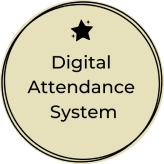
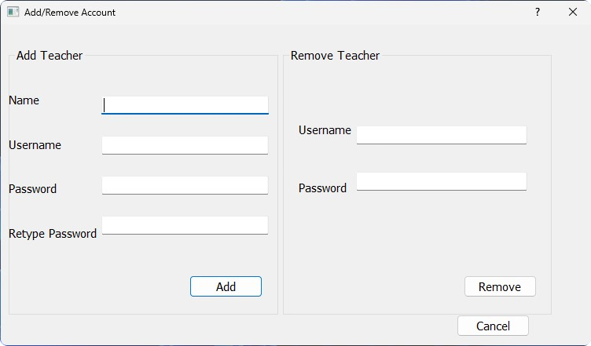
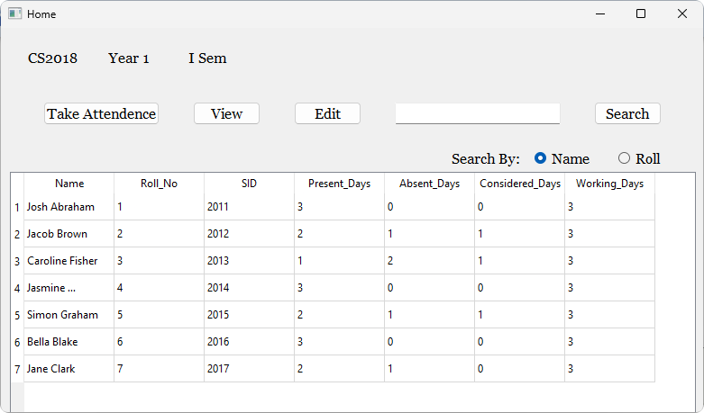
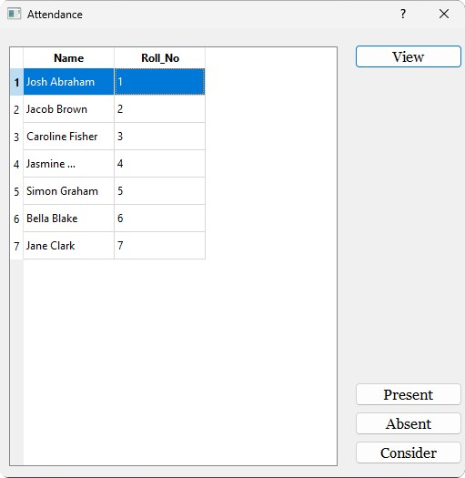
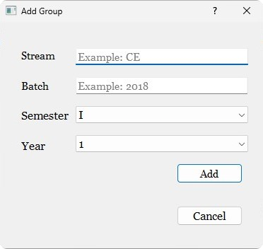

<h1 align="center">
    
</h1>
<h3 align="center">
    <b>Digital Attendance System - An easy approach to make attendance system digitized</b>
</h3>

## About 
<h1></h1>

Digital Attendance System is a digital attendace management desktop application that can be used by teachers to track the attendance of the students.The Digital Attendance System promises to mitigate the problems of manual attendance system.

## Key Features 🧑‍💻

- Computarized attendance system  
- Add and edit the records of the students
- Tracking the attendance and details of the students
- Exporting the attendance and details of the students to generate the report

## Run Locally (Development Environment) ⚒️

#### Clone the repository to "Local disk C:" and navigate to  "Ditigal-Attendance-System/release/access.exe" 

## Tech and Tools Used 💻

- Frontend : QT
- Database : SQLite
- Backend  : C++, minGW Compiler

  
## Screenshots 

  
  
  
  

## Contributions

Contributions are highly appreciated. Please send a Pull Request with suggested changes or open an Issue to get things started!
